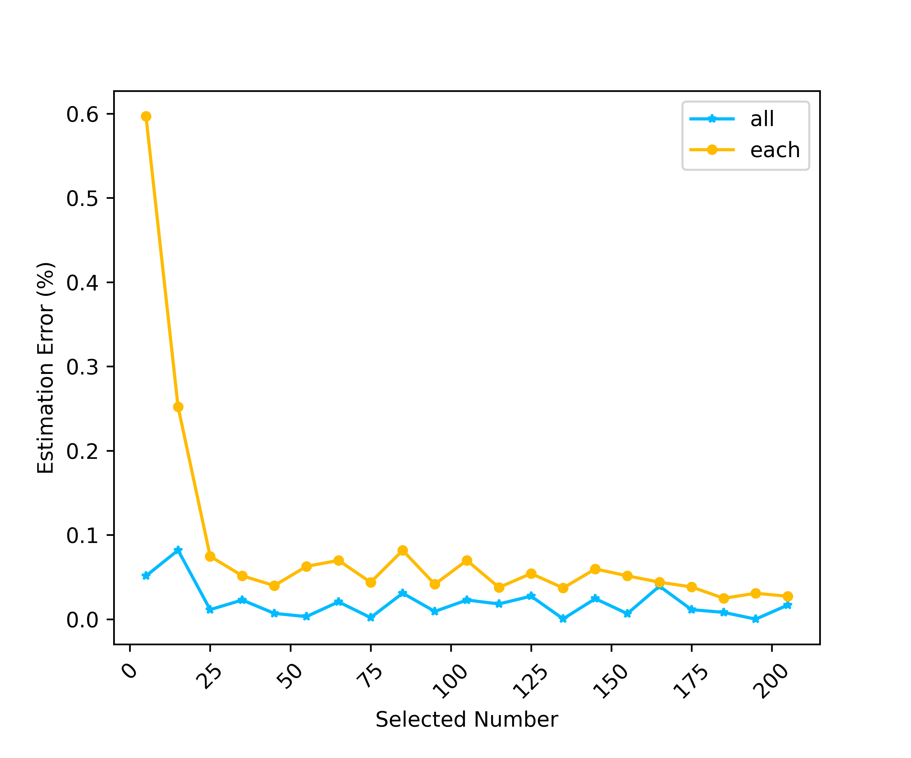

# Empirical Studies on Test Input Selection Methods for Deep Neural Network Testing

This is the implementation repository of our incoming APSEC 2021 paper: **Empirical Studies on Test Input Selection Methods for Deep Neural Network Testing**

## Description

In this paper, we propose an empirical study on Test Input Selection Methods for Deep Neural Network Testing. In our empirical study, we first select 18 pairs of DNN models and the corresponding test sets from seven popular DNN datasets as our experimental subjects. Then we consider four state-of-the-art TIS-DNN methods, including CSS, CES, DeepReduce and PACE. Moreover, we also consider a simple random sampling method SRS as a reference method. Based on these experimental subjects and TIS-DNN methods, we aim to answer the following three research questions (RQs):

1. **RQ1**: Can these TIS-DNN methods guarantee the accurate performance estimation on each class?
2. **RQ2**: Whether the accurate performance estimation on each class can help to improve the test adequacy based on DNN-based coverage criteria?
3. **RQ3**: How much perform improvement room for the current TIS-DNN methods? 

## Experiment Results

We have release out results for the experiments in this paper, which have been put in directories from RQ1 to RQ3.

* **RQ1**

  In RQ1, we analyze the accuracy estimation error for five test input selection methods on 18 models. The five test input selection methods and the models are presented as follows, along with the corresponding datasets:

  Five test input selection methods:

  * Simple Random Selection (SRS)
  * Confidence-based Stratified Sampling (CSS)
  * Confidence-based Stratified Sampling (CES)
  * DeepReduce (DR)
  * Practical ACcuracy Estimation (PACE)

  18 models with the corresponding datasets:

  | ID   |    测试集名称    |    模型    | 数据集大小（KB） | 样本数量 | 整体准确率（%） | 类别数量 | 测试数据类型 |
  | ---- | :--------------: | :--------: | :--------------: | :------: | :-------------: | :------: | :----------: |
  | 1    |      MNIST       |  LeNet-1   |       113        |  10,000  |      94.86      |    10    |   original   |
  | 2    |      MNIST       |  LeNet-4   |       947        |  10,000  |      96.79      |    10    |   original   |
  | 3    |      MNIST       |  LeNet-5   |       1093       |  10,000  |      98.68      |    10    |   original   |
  | 4    |      MNIST       | LeNet-5-M1 |       1093       |  10,000  |      79.53      |    10    |   original   |
  | 5    |      MNIST       | LeNet-5-M2 |       1093       |  10,000  |      77.27      |    10    |   original   |
  | 6    |      MNIST       | LeNet-5-M3 |       1093       |  10,000  |      79.14      |    10    |   original   |
  | 7    |     CIFAR-10     |   VGG-16   |      21814       |  10,000  |      78.71      |    10    |   original   |
  | 8    |     CIFAR-11     | ResNet-20  |       3507       |  10,000  |      91.45      |    10    |   original   |
  | 9    |    CIFAR-100     | ResNet-20  |      10615       |  10,000  |      71.42      |   100    |   original   |
  | 10   |       SVHN       |  LeNet-5   |       522        |  26,032  |      87.9       |    10    |   original   |
  | 11   |  Fashion-MNIST   |  LeNet-5   |       385        |  10,000  |      89.88      |    10    |   original   |
  | 12   |  Autogen-MNIST   |  LeNet-5   |       1093       |  10,000  |      49.35      |    10    |  generated   |
  | 13   | Autogen-CIFAR-10 | ResNet-20  |       3507       |  10,000  |      42.92      |    10    |  generated   |
  | 14   |   Autogen-SVHN   |  LeNet-5   |       522        |  10,000  |      43.69      |    10    |  generated   |
  | 15   | Autogen-Fashion  |  LeNet-5   |       385        |  10,000  |      45.31      |    10    |  generated   |
  | 16   |     ImageNet     |   VGG-19   |      562176      |  50,000  |      64.73      |   1000   |   original   |
  | 17   |     ImageNet     | ResNet-50  |      100352      |  50,000  |      68.27      |   1000   |   original   |
  | 18   | Speech-Commands  | DeepSpeech |       6734       |  6,471   |      94.53      |    30    |   original   |

  In this directory, we presents the results for the previous mentioned experiment, and draw figures for precisely presentation. The results for 18 models are put in the 18 folders separately. We will show some figures for detailed explanation. As we can see from the figure, each of the figures contains two curves, in which the blue curve means the total accuracy estimation error of the model, while the orange curve denotes the average accuracy estimation error of each single class.

  

  

* **RQ2**

  In RQ2, we aim to investigate whether accurate performance estimation on each class can help to improve the test adequacy of the subset based on DNN-based coverage criteria.
  
  To investigate RQ2, we first aim to construct subsets, which can cover different classes. For each model, we will generate five different test subsets from the original set with different random seeds when given the fixed number of the covered classes. For each generated subset, we will run TIS-DNN methods to compute the accuracy estimation error $AccEE_{each}$ for each class.
  
  Then we consider the five popular deep neuron network-based coverage criteria (i.e., NC, NBC, SNAC, TKNC, and KMNC). 
  
  Finally, we will compute the correlation coefficient between the accuracy estimation error for each class $AccEE_{each}$ and the coverage difference $CovDiff$ when given a DNN-based coverage criterion.
  
  In our study, we utilize the Pearson correlation coefficient  and the Pearson correlation coefficient can be computed as follows:
  
  $$r(X,Y)=\frac{Cov(X,Y)}{\sqrt{Var[X]\cdot Var[Y]}}$$
  
  where $X$ and $Y$ are one-dimensional vectors, $Cov(X, Y)$ means the covariance of $X$ and $Y$, and $Var[Y]$ denotes the variance of the vector $Y$.
  
  The final results are shown in the following table:
  
  | ID   | NC    | NBC    | SNAC   | TKNC   | KMNC   |
  | ---- | ----- | ------ | ------ | ------ | ------ |
  | 1    | 0.965 | N/A    | 0.838  | 0.745  | 0.77   |
  | 2    | 0.867 | -0.054 | 0.807  | 0.732  | -0.258 |
  | 3    | 0.935 | -0.202 | 0.876  | 0.865  | 0.032  |
  | 4    | 0.845 | 0.411  | 0.838  | 0.786  | 0.005  |
  | 5    | 0.919 | 0.05   | 0.906  | 0.947  | -0.147 |
  | 6    | 0.922 | 0.032  | 0.925  | 0.949  | -0.347 |
  | 7    | 0.99  | 0.765  | 0.778  | 0.904  | 0.237  |
  | 8    | 0.754 | -0.412 | -0.093 | 0.917  | 0.883  |
  | 9    | 0.961 | -0.043 | 0.378  | 0.885  | 0.049  |
  | 10   | 0.945 | 0.929  | 0.934  | 0.969  | 0.542  |
  | 11   | 0.932 | 0.759  | 0.762  | 0.909  | 0.588  |
  | 12   | 0.535 | -0.669 | -0.489 | -0.852 | 0.099  |
  | 13   | 0.574 | 0.478  | 0.024  | 0.883  | 0.372  |
  | 14   | 0.861 | 0.345  | 0.313  | 0.828  | -0.901 |
  | 15   | 0.941 | -0.393 | 0.894  | 0.983  | 0.753  |
  | 16   | 0.956 | 0.949  | 0.956  | 0.948  | 0.757  |

* **RQ3**

  After comparing the optimal subsets, we can compute the performance improvement room of the current TIS-DNN methods in this RQ.

  In this RQ, we design a simple method Best.
  Specifically, given the size of the subset, this method first determines the sampling number $sampNum[i]$ for $i$-th class according to the proportion of each class in the original test inputs.

  Then for the $i$-th class, it computes the sampling number  of test inputs $sampNum_{c}[i]$ which are predicted correctly and the sampling number of test inputs $sampNum_{w}[i]$ which are predicted wrongly based on the accuracy of the $i$-th class of the original test inputs.

  Later, for the $i$-th class, it samples $sampNum_{c}[i]$ test inputs with the correct predictions, and  $sampNum_{w}[i]$ test inputs with the wrong predictions from the original inputs in the $i$-th class.

  Finally, after iterating all the classes, it can determine the optimal subset.

  In this RQ, we first show the performance improvement room  after comparing the method Best and the method PACE. Final results (i.e., average value and standard deviation) can be found in the following table:

  |  ID  | Room for $AccEE_{all}$ | Room for $AccEE_{each}$ |
  | :--: | :--------------------: | :---------------------: |
  |  1   |    (3.561%, 6.261%)    |    (2.948%, 5.780%)     |
  |  2   |    (1.887%, 3.159%)    |    (2.080%, 4.166%)     |
  |  3   |    (0.444%, 0.476%)    |    (1.402%, 4.269%)     |
  |  4   |    (1.672%, 1.788%)    |    (1.471%, 2.822%)     |
  |  5   |    (2.207%, 2.886%)    |    (3.110%, 7.060%)     |
  |  6   |    (2.154%, 3.958%)    |    (2.649%, 6.654%)     |
  |  7   |    (4.838%, 3.745%)    |    (12.514%, 9.097%)    |
  |  8   |    (1.544%, 1.561%)    |    (3.617%, 2.049%)     |
  |  9   |    (1.353%, 1.831%)    |    (10.204%, 4.726%)    |
  |  10  |    (6.401%, 7.684%)    |    (9.519%, 7.934%)     |
  |  11  |    (2.092%, 4.018%)    |    (5.200%, 11.802%)    |
  |  12  |    (1.562%, 1.762%)    |    (3.503%, 1.982%)     |
  |  13  |    (1.302%, 3.341%)    |    (9.674%, 5.283%)     |
  |  14  |    (0.908%, 2.499%)    |    (9.108%, 4.564%)     |
  |  15  |    (1.567%, 1.806%)    |    (10.451%, 7.368%)    |
  |  16  |    (5.757%, 9.619%)    |    (11.012%, 6.275%)    |
  |  17  |    (3.426%, 4.513%)    |    (9.185%, 6.777%)     |
  |  18  |    (5.232%, 8.137%)    |    (9.250%, 5.857%)     |

  Then we analyze the effect of the class number on the performance improvement room.
  We compute the average value and the standard deviation grouped by the class number and the results can be found in the following table. 

  In this table, we can find with the increase of the class number, the performance improvement room for $AccEE_{all}$ increases, while the performance improvement room for $AccEE_{each}$ decreases.

  | \# class | Room for $AccEE_{all}$ | Room for $AccEE_{each}$ |
  | :------: | :--------------------: | :---------------------: |
  |    10    |    (3.018%,2.959%)     |     (5.908%,4.217%)     |
  |    30    |    (2.092%,4.018%)     |    (5.200%,11.802%)     |
  |   100    |    (1.353%,1.831%)     |    (10.204%,4.726%)     |
  |   1000   |    (1.105%,2.879%)     |     (9.391%,4.906%)     |

